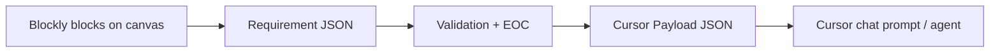

# Front-End Data Entry & Blockly → Cursor JSON Mapping

How users enter requirements manually in the workbench (without **Load Sample**), and how each Blockly block maps to **Requirement JSON** and **Cursor Payload JSON**.

---

## 1) Manual data entry (front-end workflow)

**Load Sample** is optional. Real capture happens by dragging blocks from the toolbox and filling fields on the canvas.

### Step-by-step

| Step | What you do | Where in UI |
|------|-------------|-------------|
| 1 | Open the app (`/` or local `:5173`) | Browser |
| 2 | Drag **Requirement ID** from **Start / Trigger** onto the canvas | Left toolbox |
| 3 | Type a valid ID, e.g. `REQ-SALES-001` | Root block field `REQ_ID` |
| 4 | Drag blocks **into the root block’s body slot** (snap under Requirement ID) | Canvas — must form a **chain** |
| 5 | Fill each block’s text fields or dropdowns | Click field on block |
| 6 | Click **Save & Validate** | Top toolbar |
| 7 | Fix any validation errors shown in the status bar | Status line under buttons |
| 8 | Click **Export Requirement JSON** or **Export Cursor Pack** | Top toolbar |

### Minimum blocks for a valid requirement

| Order (typical) | Block | Required? |
|-----------------|-------|-----------|
| 1 | Requirement ID (`pbmp_requirement_root`) | Yes — exactly one |
| 2 | Goal | Strongly recommended |
| 3 | Actor (dropdown) | Recommended |
| 4 | Trigger / Start | Recommended |
| 5 | Condition | **Yes** — at least one |
| 6 | Create Task / Action / Notify | At least one action path |
| 7 | Acceptance Criteria | Recommended for Cursor traceability |

### Important rules

1. **Chain under root** — blocks must snap into the Requirement ID **body**, not float alone on the canvas.
2. **Dropdown vocabulary** — Actor, Entity, and role fields must use approved values (validation rejects unknown values).
3. **Requirement ID format** — must match `REQ-<DOMAIN>-<digits>` (e.g. `REQ-SALES-001`).
4. **Event feedback** — the status bar shows “Block added”, “Value changed”, etc. as you edit.

### Example manual stack (same semantics as sample)

```
Requirement ID [REQ-SALES-001]
  └─ Goal [Improve high-score lead follow-up]
  └─ Actor [Sales Manager ▼]
  └─ Trigger / Start [Lead score updated]
  └─ Condition [lead_score] [>] [80]
  └─ Create Task [Follow up with customer] for role [Sales Manager ▼]
  └─ Send Notification to [Sales Manager ▼] message [High-score lead needs follow-up]
  └─ Acceptance Criteria [Given score > 80, then task is created]
```

### What happens on Save & Validate

```
Blockly canvas
  → exportRequirementJson()  (client/src/export/requirement-exporter.js)
  → POST /api/requirements/validate
  → POST /api/requirements (if valid)
  → saved under server data + status "Saved REQ-… — validation passed"
```

### What happens on Export Cursor Pack

```
Blockly canvas
  → exportRequirementJson()
  → toCursorImplementationPayload()  (client)
  → download cursor-payload-<id>.json
  → POST /api/cursor/dispatch
  → server adds expected_output_contract + writes pbmp-implementation-pack/cursor/
  → Cursor dispatch modal (deep-link / copy prompt)
```

---

## 2) Pipeline overview



| Stage | File / API | Purpose |
|-------|------------|---------|
| Canvas | `client/src/blocks/pbmp-blocks.js` | User enters business facts |
| Export | `client/src/export/requirement-exporter.js` | Deterministic block → JSON |
| Validate | `server/lib/validator.js` | Schema + vocabulary gates |
| EOC | `requirementToExpectedOutputContract()` | Design-stage contract |
| Cursor | `server/routes/cursor.js` | Payload file + chat prompt |

---

## 3) Block → Requirement JSON mapping (full table)

| Blockly block type | Block field(s) | Requirement JSON path | Notes |
|--------------------|----------------|----------------------|-------|
| `pbmp_requirement_root` | `REQ_ID` | `requirement_id` | Root; must exist once |
| (all blocks) | — | `blockly_workspace` | Full workspace snapshot for reload |
| `pbmp_goal` | `GOAL_TEXT` | `goal` | String |
| `pbmp_actor` | `ACTOR` | `actor` | Dropdown → approved actor |
| `pbmp_trigger` | `TRIGGER` | `trigger` | String |
| `pbmp_condition` | `FIELD`, `OPERATOR`, `VALUE` | `conditions[]` | `{ field, operator, value }` |
| `pbmp_condition` | (single item) | `condition` | Copy of lone `conditions[0]` |
| `pbmp_create_task` | `TITLE`, `ASSIGNED_ROLE` | `actions[]` | Human string |
| `pbmp_create_task` | `TITLE`, `ASSIGNED_ROLE` | `structured_actions[]` | `{ action: "create_task", title, assigned_role }` |
| `pbmp_action` | `ACTION` | `actions[]` | Free-text action |
| `pbmp_action` | `ACTION` | `structured_actions[]` | `{ action: "generic", description }` |
| `pbmp_notify` | `ROLE`, `MESSAGE` | `notifications[]` | `{ role, message }` |
| `pbmp_notify` | `ROLE`, `MESSAGE` | `actions[]` | `"Notify {role}: {message}"` |
| `pbmp_notify` | `ROLE`, `MESSAGE` | `structured_actions[]` | `{ action: "send_notification", ... }` |
| `pbmp_data_entity` | `ENTITY` | `data_entities[]` | Approved entity name |
| `pbmp_business_rule` | `RULE` | `business_rules[]` | String |
| `pbmp_acceptance` | `AC` | `acceptance_criteria[]` | String (Gherkin-style) |
| `pbmp_nfr` | `NFR_TYPE`, `NFR_VALUE` | `nfrs.{NFR_TYPE}` | Object key = type |
| `pbmp_approval` | `APPROVAL` | `approvals[]` | Role string |
| `pbmp_output` | `OUTPUT` | `outputs[]` | Traceability text |
| `pbmp_procedure_def` | `PROC_NAME`, `PROC_INPUTS`, `BODY` | `procedures[]` | `{ kind: "procedure", name, inputs, body }` |
| `pbmp_procedure_call` | `PROC_NAME` | `procedures[]` | `{ kind: "procedure_call", name }` |
| `pbmp_procedure_call` | `PROC_NAME` | `actions[]` | `"Run procedure: {name}"` |
| `pbmp_function_def` | `FUNC_NAME`, `FUNC_INPUTS`, `FUNC_RETURNS`, `BODY` | `functions[]` | `{ kind: "function", ... }` |
| `pbmp_function_call` | `FUNC_NAME` | `functions[]` | `{ kind: "function_call", name }` |
| — | — | `status` | Always `"Draft"` on export |

**Note:** `pbmp_conditions_list` and `pbmp_actions_list` are layout helpers; put `pbmp_condition` / action blocks inside their inner slots. Only leaf blocks above are read by the exporter today.

---

## 4) Requirement JSON → Cursor Payload mapping

Cursor payload is built by `toCursorImplementationPayload()` (client) and `buildCursorPayload()` (server). Fields copy across directly; server adds `expected_output_contract`.

| Requirement JSON field | Cursor payload field | Transformed? |
|------------------------|----------------------|--------------|
| — | `source` | Constant: `"PBMP_Product_Discovery"` |
| — | `instruction` | Fixed anti-hallucination text |
| `requirement_id` | `requirement_id` | Direct |
| `goal` | `goal` | Direct |
| `trigger` | `trigger` | Direct |
| `condition` | `condition` | Direct |
| `conditions` | `conditions` | Direct |
| `actions` | `actions` | Direct |
| `structured_actions` | `structured_actions` | Direct — **preferred for codegen** |
| `acceptance_criteria` | `acceptance_criteria` | Direct |
| `nfrs` | `nfrs` | Direct |
| `out_of_scope` | `out_of_scope` | Direct (default `[]`) |
| `procedures` | `procedures` | Direct |
| `functions` | `functions` | Direct |
| (not in requirement export) | `expected_output_contract` | **Server only** — from `requirementToExpectedOutputContract()` |
| — | `pipeline` | Fixed stage list |

### Fields in Requirement JSON **not** sent to Cursor payload

| Requirement JSON field | Why omitted from Cursor payload |
|------------------------|--------------------------------|
| `actor` | Rolled into `expected_output_contract.actors` |
| `data_entities` | Rolled into EOC `data_entities` |
| `business_rules` | Rolled into EOC `business_rules` |
| `notifications` | Already represented in `actions` / `structured_actions` |
| `approvals` | EOC `approved_by` uses first approval |
| `outputs` | Traceability only |
| `blockly_workspace` | Not sent to Cursor (UI round-trip only) |
| `status` | Workflow metadata |

### EOC derivation (server)

| Requirement JSON | `expected_output_contract` field |
|------------------|----------------------------------|
| `requirement_id` | `expected_output_contract_id` → `EOC-{suffix}` |
| `goal` | `expected_business_outcome` |
| `actions` | `in_scope` |
| `actor` | `actors[]` |
| `data_entities` | `data_entities` |
| `business_rules` | `business_rules` |
| `acceptance_criteria[i]` | `acceptance_criteria[i]` → prefixed `AC-{REQ-ID}-{n}:` |
| `nfrs` | `nfrs` |
| `approvals[0]` | `approved_by` (or `"Pending"`) |

---

## 5) Side-by-side example (REQ-SALES-001)

### Blockly (conceptual)

- Requirement ID: `REQ-SALES-001`
- Goal, Actor, Trigger, Condition, Create Task, Notify, Acceptance

### Requirement JSON (excerpt)

```json
{
  "requirement_id": "REQ-SALES-001",
  "goal": "Improve high-score lead follow-up",
  "actor": "Sales Manager",
  "trigger": "Lead score updated",
  "condition": { "field": "lead_score", "operator": ">", "value": "80" },
  "structured_actions": [
    { "action": "create_task", "title": "Follow up with customer", "assigned_role": "Sales Manager" },
    { "action": "send_notification", "assigned_role": "Sales Manager", "message": "High-score lead needs follow-up" }
  ],
  "acceptance_criteria": ["Given score > 80, then task is created"]
}
```

### Cursor payload (excerpt)

```json
{
  "source": "PBMP_Product_Discovery",
  "requirement_id": "REQ-SALES-001",
  "goal": "Improve high-score lead follow-up",
  "trigger": "Lead score updated",
  "structured_actions": [
    { "action": "create_task", "title": "Follow up with customer", "assigned_role": "Sales Manager" },
    { "action": "send_notification", "assigned_role": "Sales Manager", "message": "High-score lead needs follow-up" }
  ],
  "acceptance_criteria": ["Given score > 80, then task is created"],
  "expected_output_contract": {
    "expected_output_contract_id": "EOC-SALES-001",
    "expected_business_outcome": "Improve high-score lead follow-up",
    "in_scope": ["Create task \"Follow up with customer\" for role Sales Manager", "..."],
    "actors": ["Sales Manager"]
  }
}
```

Full reference file: `pbmp-implementation-pack/cursor/cursor-payload-REQ-SALES-001.json`

---

## 6) Hindi summary (संक्षिप्त)

### डेटा कैसे दर्ज करें (Load Sample के बिना)

1. Toolbox से **Requirement ID** block खींचें  
2. ID टाइप करें — `REQ-SALES-001`  
3. Goal, Actor, Trigger, Condition, Actions blocks **root के अंदर chain** में जोड़ें  
4. Dropdown/text भरें  
5. **Save & Validate** → errors fix करें  
6. **Export Cursor Pack** → JSON + Cursor prompt  

### मैपिंग (सरल)

| Blockly | JSON | Cursor |
|---------|------|--------|
| Requirement ID | `requirement_id` | `requirement_id` |
| Goal | `goal` | `goal` |
| Condition | `conditions[]` | `conditions[]` |
| Create Task | `structured_actions[]` | `structured_actions[]` |
| Acceptance | `acceptance_criteria[]` | `acceptance_criteria[]` |

Blockly → Requirement JSON = `exportRequirementJson()`  
Requirement JSON → Cursor = `toCursorImplementationPayload()` + server EOC

---

## 7) In-app preview

Click **Help & JSON Mapping** in the toolbar to open the live panel:

- Manual entry checklist  
- Static mapping table  
- **Preview from workspace** — current Requirement JSON + Cursor payload side by side  
